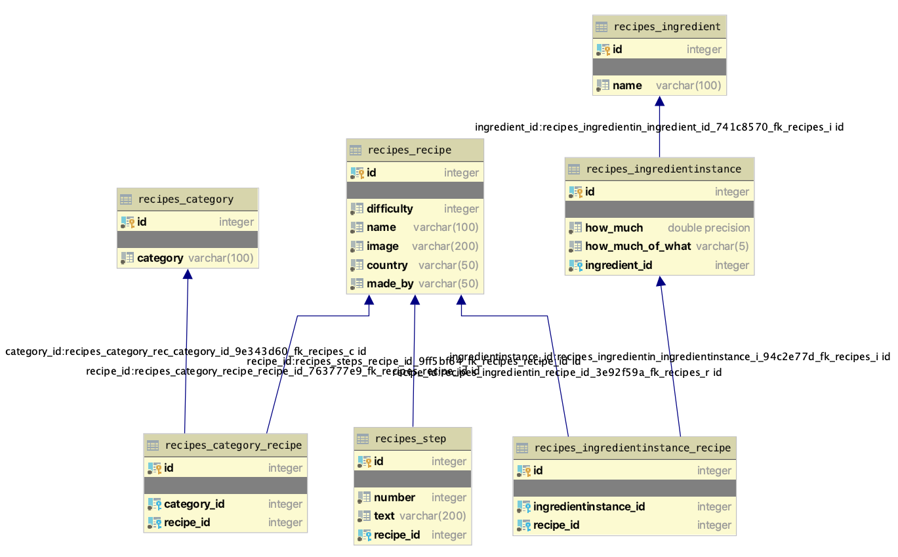

# culinary-app - Piotr Połeć, Błażej Kustra

Aplikacja internetowa przeznaczona do udostępniania oraz poznawania przepisów kulinarnych. 

Technologie: 
 - Python (Django)
 - PostgreSQL

### Funkcjonalności: 

 - Rejestracja, logowanie użytkowników
 - Dodawanie/Usuwanie/Modyfikacja przepisów (Operacje CRUD)
 - Panel administratora do zarządzania przepisami
 - Wyszukiwarka przepisów

### Schemat bazy:

### Przewodnik po kodzie:

 - **`manage.py`** - Główny plik django, serce aplikacji

 - **`sql_code.sql`** - Wygenerowany kod SQL modeli aplikacji
 
 - **Folder `recipe`** - Pliki generowane przez django
    - `settings.py` - Podstawowe ustawienia aplikacji np. adres do bazy danych
    - `urls.py` - Lista routingu do widoków aplikacji
    - `wsgi.py` - Web Server Gateway Interface
    - `asgi.py` - Asynchronous Server Gateway Interface
    
 - **Folder `recipes`**
    - `apps.py` - Podstawowa konfiguracja aplikacji np. nazwa
    - `models.py` - Modele obiektów
    - `views.py` - Wygląd poszczególnych stron
    - `urls.py` - Lista routingu do widoków aplikacji
    - `help_classes.py` - Klasy uzupełniające
    - `help_functions.py` - Funkcje pomocnicze (utils)
    - `admin.py` - Panel administratora
    - `tests.py` - Testy
    - Folder `migrations` - Folder z migracjami
    - Folder `static` - Style stron + grafiki
    - Folder `templates` - Templatki stron w html

### Decyzje projektowe:
 - W początkowej wersji aplikacji nie zakładaliśmy, że przepisy będą miały swój kraj pochodzenia. Znaleźliśmy pakiet Pythona który idealnie nadawałby się do tego, i z tego powodu zdecydowaliśmy się zahardkodować część państw tak aby dało się przyporządkować przepisy do konkretnych krajów. W przypadku braku państwa na liście możemy wybrać opcje "inny". Dlatego też państwa nie mają osobnej tabeli a np. kategorie mają.
 - W większości metod korzystaliśmy z djangowego podejścia do budowy aplikacji, przy wyszukiwarce natchnęliśmy sie jednak na ograniczenia dostępnych metod i postanowiliśmy zbudować zapytanie SQL'owe odpowiadające naszym wymaganiom.
 - Ze względu na to, że PostgresSQL posiada ENUM'y postanowiliśmy z nich skorzystać. Wygodnie było z nich skorzystać w dwóch wypadkach: "Measurement" oraz "Difficulty" 
